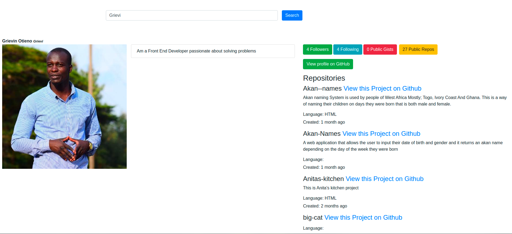

# Git-Search App
This is a website to search for github usernames and repositories Created by Grievin Otieno August/31/08/2021

## Description

Git-search app is a simple easy to use website to search repositories by username or by repository name across Github.

### App Preview and Description

* Enter your username/repo you want to search in the search bar input 
* Click search 
* Wait and see the result

#### landing page

#### Search Result

## Setup Installation/Requirements
* Install angular CLI
* Fork this repo
* Copy the url
* Clone the copied Url to your Terminal in your computer
* ng serve -o to open your application

## Technologies Used

* Angular 
* Bootsrap
* HTML
* CSS

## Known Bugs
No Known Bugs at the moment

## Support and Contact Details
You can get intouch with me via enogroti@gmail.com or on cell 0714 880 548
## Licence
Read our licences Copyright (c) 2021 Grievin Otieno